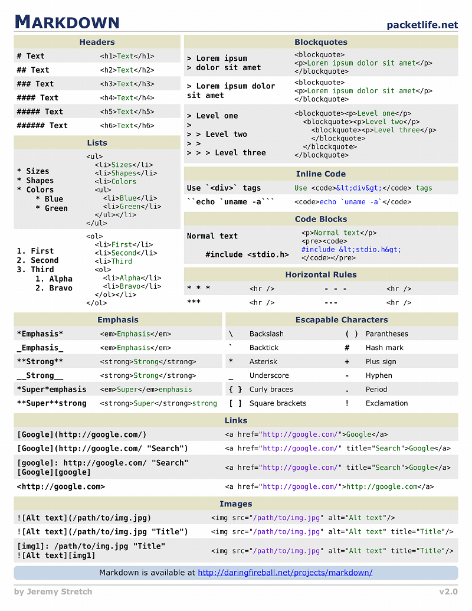

## Предисловвие
Здесь краткая инфа по markdown - упрощенному языку разметки документов.
Он компилится в HTML. Но в нескомпилированном виде сохраняет человекочитаемость.

* Навигация по разделам
{:toc}

## Общее

Здесь немножко о переменных и других програмных фишках, которые использует компилятор страниц на GitHub Pages.

При публикации страниц на Github Pages - HTML так и остается в исходном формате, а вот Markdown-файлы преобразовываются в HTML.  
Преобразование происходит с помощью Jekyll - это генератор статических сайтов. Широко используется там где не нужно динамически менять контент. Позволяет сэкономить тонну ресурсов на поддержание сервера.

Существуют аналоги:  Например Hugo. (больше можете нагуглить)  
Все они как и Jekyll могут быть установлены на локальную машину для преобразования локальных файлов в HTML пригодный для публдикации.  Но я считаю что Markdown уже пригоден для публикации, это его основная фишка - сохранение читаемости в нескомпилированном виде. А поэтому предпочитаю предоставить процесс сборки страниц серверам ГитХаба. Тем более это бесплатно и дает преимущество в виде возможности исполшьзовать сам GitHub в качестве CMS для ручного редактирования контента на сайте с любого устройства где есть браузер.

В Jekyll и на Github Pages можно менять предпочтительный метод компиляции файлов markdown путем изменения конфигурации в файле \_config.yml. Я оставил kramdown, поскольку лень.
* kramdown (по умолчанию)
* CommonMarkGhPages (как на самом гитхаб)
* (добавить)

**Рекомендую почитать официальную документацию**
* на Jekyll: <https://jekyllrb.com/docs/step-by-step/08-blogging/#list-posts>  
* И на kramdown: <https://kramdown.gettalong.org/converter/html.html>  

## Liquid скриптинг

Компания Shopify создала систему гибкого скриптования шаблонов для своего сервиса интернет-магазинов shopify.com. Это напоминает мне о шаблонах TPL в OpenCart 3. Там тоже используются похожие вставки типа ```{{  php-код }}```

Так вот, для настройки страниц можно (и нужно) использовать так называемые Liquid-скрипты. Это как голый код на PHP или Ruby, но он предподготовленный и можно использовать только те функции, которые уже заданы и разрешены. При любой ошибке в файле конфигурации перестанет собираться сайт, а при ошибке скипта жидкого скрипта в странице - он будет интерпретировани как обычный текст.  

**Официальная джокументация:** 
* Из первоисточника: <https://shopify.github.io/liquid/basics/operators/#order-of-operations>  
* Доки от Github: <https://github.com/Shopify/liquid/wiki/Liquid-for-Designers>  

Пример такого "жидкого скрипта" в слеующем параграфе


## блог-платформа

С помощью цикла for можно вывести список всех страниц (постов) на сайте. То-есть не нужно прописывать ссылки вручную. Это дает возможность сосредоточиться на написании качественного контента вместо того что бы переживать не забыл ли ты часом добавить ссылку в навигацию. Я сначала пытался делать сайт таким образо, поэтому знаком личнго стем какая это попоболь. При количестве страниц больше десяти начинаются сложности.

Пример такого цикла:
```
<ul>
  { % for post in site.posts %}
    <li>
      <h2><a href="{ { post.url }}">{ { post.title }}</a></h2>
      { { post.excerpt }}
    </li>
  { % endfor %}
</ul>
```
Ссылка на источник: <https://jekyllrb.com/docs/step-by-step/08-blogging/#list-posts>  

## Модули

В файле \_config.yml задается вся конфигурация публикуемого с помощью Jekyll сайта. В том числде модули - эдакие доп. обработчики содержимого перед публикацией.

Добавляются так:
```
plugins:
  - jemoji
  - jekyll-paginate
  - jekyll-gist
```

На Github Pages поддерживается строго ограниченный список модулей: <ссылка>

## Мини-справочник

(заполнить)

## Более ранние заметки:

Просто тестирую как работает Lykyll :)      
  
Ссылки вида "site.github.repository_url". (подробнее смотри исходники)  
[Repository]({{ site.github.repository_url }})  
[Скачать.zip]({{ site.github.zip_url }})  
[Скачать.tar.gz]({{ site.github.tar_url }})  

Простая ссылка "a href": <a href="#">Видно?</a>  

Проверка. site.github.is_project_page? 
если видно этот текст, значит да.  
Проверка. site.show_downloads? 
Сработало!  

Переменные логические:  
site.github.is_project_page: {{ site.github.is_project_page }};  
site.show_downloads: {{ site.show_downloads }};  

Переменные.  
site.copyright: {{ site.copyright | default: :copyright: }};  
site.github.owner_url: {{ site.github.owner_url }};  
site.github.owner_name: {{ site.github.owner_name }};  
site.layout: {{ site.layout }};  
page.layout: {{ page.layout }};  
site.github.is_user_page: {{ site.github.is_user_page }};  

Логическое "или":  
page.title | default: site.title | default: site.github.repository_name: {{ page.title | default: site.title | default: site.github.repository_name }};

## Дополнительно

Как оказалось, github использует jekyll для генерации страниц. А тот в свою очередь может использовать так называемые liquid скриптинг за авторством shopify. 
Вот официальная документация как им пользоваться: <https://github.com/Shopify/liquid/wiki/Liquid-for-Designers>

Также стоит знать что кроме "жидких" скриптов для ещё большей кастомизации генератор можно настраивать в файле конфига _config.yaml. Вплоть до того, что можно изменить парсер markdown файлов. Стандартный, кстати, называется kramdown. Его официальная документация [google]


А это инфа по настройке jekyll <https://webref.ru/dev/building-jekyll-site/converting-static-site-to-jekyll>


## Собираю тут ссылки на шпаргалки про markdown

* <http://bustep.ru/markdown/shpargalka-po-markdown.html#tables>
* <https://devhints.io/jekyll-github>
* [Jekyll for GitHub pages cheatsheet](https://devhints.io/jekyll-github)
*


# Шпаргалка Markdown


**[Markdown][1]{: rel="nofollow"}** — это облегченный язык разметки, призванный облегчить подготовку текстов для публикации в Интернете. Был создан для удобства чтения и написания размеченных текстов. Движок markdown генерирует валидный XHTML. Авторы - John Gruber и Aaron Swartz. 
Собственно, Markdown — это простой текст. 

**Jekyll** использует *markdown* нативно, вообще данный язык разметки очень любят на *[GitHub][2]{: rel="nofollow"}*, используют его везде, где только
можно (и в комментариях, и в отчетах, и в readme файлах). Данный блог использует *jekyll*, потому этот пост - это маленькая шпаргалка по Markdown.
 
## Синтаксис
Оригинальное описание синтаксиса находится здесь (англ.): <http://daringfireball.net/projects/markdown/syntax>{: rel="nofollow"}
 
Ниже следует краткое описание синтаксиса.
 
* Абзацы разделяются пустой строкой
* Два или более пробела на конце строки задают разрыв строки
* Шрифты: **жирный**: `**жирный**`, _курсив_:`_курсив_`, ***жирный и курсив***: `***жирный и курсив***`, `моноширинный`:`` `моноширинный` ``
* Заголовки:
  + Atx-style: `#первый уровень#`, `##второй уровень##` и т.д.
  + Setext-style: подчеркивание знаками `=` задает первый уровень, дефисами `-` — второй
* Цитаты: `> текст цитаты`
* Списки:
  + неупорядоченные: `* элемент списка` (также могут использоваться символы `-` или `+`).
  + упорядоченные: `1. элемент списка`
* Блок кода — каждая строка начинается с 4 или более пробелов
* Горизонтальная черта: три или более дефиса или звездочки
* Ссылки:
  + встроенные `[label](url "url title")`
  + автоматические `<url>`
  + в виде сносок
* Изображения:
  + встроенные ``
  + в виде сносок
* Экранирование символов — чтобы вставить спецсимвол, используемый в разметке, как обычный символ, его нужно предварить
символом обратной косой черты. Экранироваться должны следующие символы: `* _ { } [ ] ( ) # + - . !` 

Таблицы:  

        | First Header  | Second Header |
        | ------------- | ------------- |
        | Row1 Cell1    | Row1 Cell2    |
        | Row2 Cell1    | Row2 Cell2    |  

Результат:

| First Header  | Second Header |
| ------------- | ------------- |
| Row1 Cell1    | Row1 Cell2    |
| Row2 Cell1    | Row2 Cell2    |

Наглядная визуальная шпаргалка:


[1]: http://ru.wikipedia.org/wiki/Markdown "Markdown"
[2]: https://www.github.com/ "GitHub"


[Источник](http://alexprivalov.org/markdown-short-reference)
