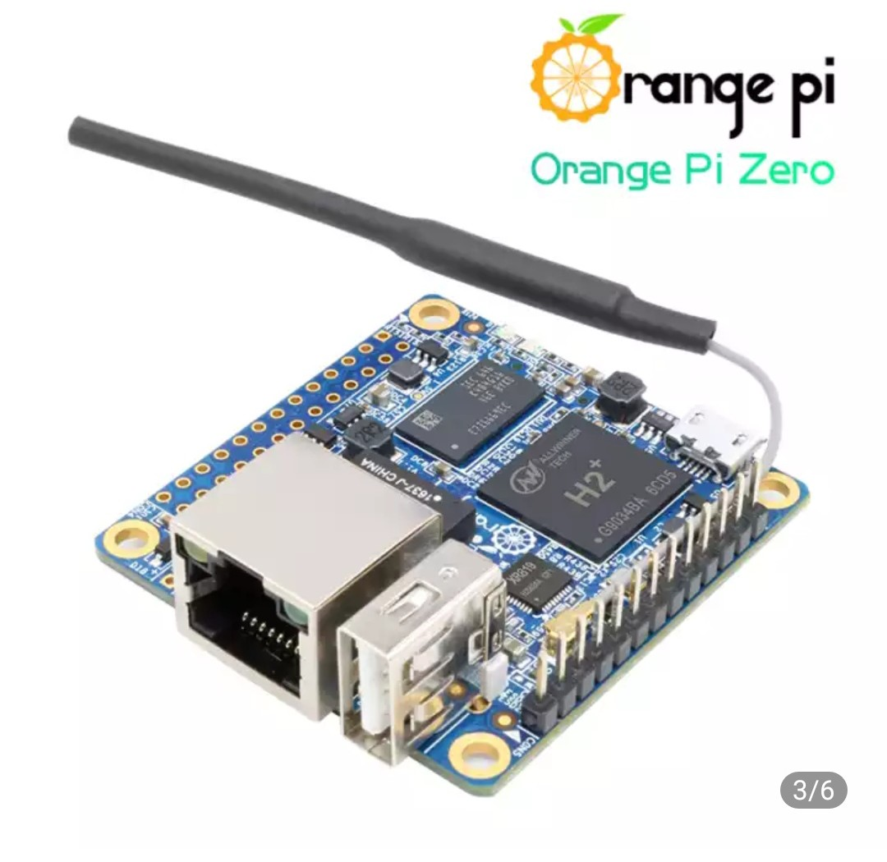

## Мой выбор Orange Pi
Себе для экспериментов взял "Orange Pi One H3 1Gb" за $26. Этот компьютер меньше стандартных OPi PC, но на борду есть все необходимое, в том числе HDMI. Сначала собирался брать Zero на H2, но ее резко убралы с продажи на али. Взамен добавили Zero H3 за $21. Я решил, что раз уж доплачивать за более шустрый проц, тогда уж лучше взять One еще и с выходом на монитор.  

Ниже по странице будет каталог одноплатников скопированный из официального магазина на али. Здесь приведу список только фаворитов, которые по моему мнению нужно заценить.

- [**Orange Pi Zero LTS 512Mb**](https://aliexpress.ru/item/4000108887089.html). Цена $18 + $3.37 доставка + $2 корпус +$2 плата расширения. Микрокомпьютер для IoT c Ethernet, но без HDMI. Процессор Allwinner H2+. Версия LTS вышла в 2019 году, в ней улучшены Wi-Fi и уменьшен нагрев.  
- [**Orange Pi One 1GB H3**](https://aliexpress.ru/item/1005002430421097.html). 
Цена $26+$3.37 доставка. Пожалуй самая оптимумальная плата. Основана на популярном чипе H3, что значит минимум проблем с софтом. Есть HDMI, USB, малеькая. Если размер не важен, возможно лучше взять Pi PC H3 за $28, там больше USB-разъемов.
- [**Pi PC plus**](#). $36. H3 1Gb 8ssd. Встроенная память eMMC немножко более вынослива чем microSD

## Почему не малина?
Я собирался брать opi Zero. В основном из-за цены. Для нужд IoT не нужен HDMI, почему бы не сэкономить? Так я думал до того как Zero H2 пропали из продажи. Но малина все-равно дороже.  
А вообще у Raspberry Pi есть два преимущества. Первое - развитое комьюнити, а значит меньше багов ии больше аксессуаров. И второе, менее очевидное - это платы Compute Module. Они дорогие, но удобны для ускорения разработки. Их часто используют как мозг для оборудования. Ну а что, не будешь же пихать целый одноплатник в свое устройство? И заниматься разработкой материнки с нуля не хочется, еще проблемы с поставками начнутся...

## Интересные конкуренты
- RaspberryPi - по сути основатель всей движухи
- Banana Pi
- ODROID, 
- LattePanda, 
- ThinkerBoard
- RockPi X на винде
- Pine64
- Zotac Zbox
- Mele Quieter2
- ThinkCentre Tiny

## Каталог

**Базовые модели zero**
Отличительная особенность: 1xEthernet, 1xUSB и плата расширения

Название       | Описание
:--------------|:---
Zero, $15      |H2 512Mb, 2015
Zero LTS, $17  |H2 512Mb, 2019
Zero(new), $21 |H3 512Mb, 2021
Zero Plus, $23 |H5 512Mb

**Косят под zero**  
У Zero Plus2 вместо Ethernet теперь HDMI и добавлена флешка eMMC.  
Модель R1 - для роутеров, в ней два гигабитных RJ45.  
А Zero2 - вообще новая разработка на другом процессоре  

photos

Название        |Характеристики
:---------------|:-------------
Zero Plus2, $35 |H3 512Mb 8ssd
Zero Plus2, $37 |H5 512Mb 8ssd
Zero2, $26      |H616 1Gb 
opi R1, $24     |H2 512Mb, 2xRJ45

**Старшие модели**

Название     |Характеристики
:------------|:-------------
Pi One, $26  |H3 1Gb, мини
Pi Lite, $27 |H3 1Gb, 2xUSB
Pi PC, $28   |H3 1Gb
Pi PC2, $29  |H5 1Gb

**Ещё мощнее + eMMC**

Название        |Характеристики
:---------------|:-------------
Pi PC plus, $36 |H3 1Gb 8ssd
PC Plus2e, $75  |H3 2Gb 16ssd
Pi PC3, $80     |H6 2Gb 8ssd
Pi 4, $105      |RK3399 4Gb 8ssd

**Для сотовых сетей**

Название     |Характеристики
:------------|:----------
3G-IoT-B, $26|MT6572 512Mb 4mmc
2G-IoT, $12  |RDA8110, 500Mb
i96, $11     |A5 256Mb, тормоз

## Полезные ссылки
- [Официальный сайт](http://www.orangepi.org/)
- [Официальный магазин на али](https://aliexpress.ru/store/1553371)
- [Таблица - сравнение](https://pcminipro.ru/orangepi/tablitsa-sravneniya-modelej-orange-pi/)
