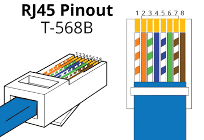

# Типы разъемов

Здесь приведу распиновка самых популярных коннекторов. Такой будет мини справочник по типу <http://rones.su> но для себя

### Интернетовский кабель RJ-45 обжиика по стандарта 948A

### USB - в компах используется повсеместно

* USB 
* Micro USB
* Mini USB
* USB Type C
