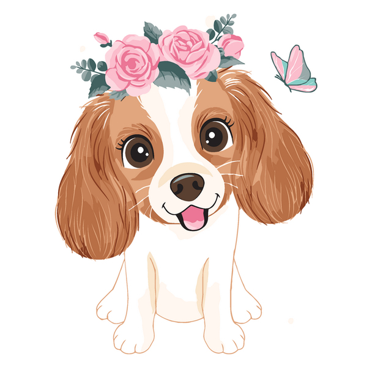
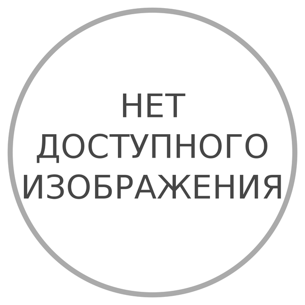


<a href="/">Home</a>

 / {{ page.title -}}

 / <a href="
  
  
    {{- crumb | append: '/' | replace:'without-plugin/','without-plugins/' -}}
  ">
  {{- crumb | replace:'-',' ' | remove:'.html' | capitalize -}}
  </a>



таблица тут: [ссылка](https://github.com/Feelcame/feelcame.github.io/blob/master/_data/pets2.csv)

<ul>



<li class="card">
<b>ФОТО тварини: {{ pet.photo }}</b> 
  
 

 

<b>Дата та місце вилову тварини:</b> 
{{ pet.mestovylova }} 
<b>Наявність або відсутність ідентифікуючих ознак та їх номери:</b> 
{{ pet.id | newline_to_br }} 
<b>Здійснені заходи з ветеринарного огляду тварини (ветеринарна допомога, карантинування, дегільментизація, інсектоакарицидна обробка, вакцинація, стерилізація, ідентифікація):</b>  
{{ pet.vaccine | newline_to_br }}  
<b>Відомості про власника тварини (ПІБ, місце проживання, договір про передачу тварини у власність):</b> 

Хозяин найден! Благодарим за внимание! ({{ pet.owner }})  
Что бы забрать питомца к себе, позвоните нам.

Ищем хозяина! <a href="#/contacts.html"><strong>Контакты</strong></a>
 


<b>Вид:</b> 
{{ pet.category }}  
<b>Стать:</b> 
{{ pet.gender }}  
<b>Приблизний вік:</b> 
{{ pet.age }}  
<b>Природні ознаки:</b> 
{{ pet.signs }}  
<b>Зовнішні ознаки (окрас шерсті, вага, особливі ідентифікуючі ознаки):</b> 
{{ pet.color }}  
<b>Попередня оцінка стану здоров’я тварини:</b> 
{{ pet.health }}  
<b>Відомості про опікуна в разі його наявності (ПІБ, місце проживання):</b> 
{{ pet.guardian }}  
<b>Дата та місце повернення тварини, якщо тварина повернута до ареалу перебування (у місця вилову):</b> 
{{ pet.address }}  

 
 
</li>
 

</ul>


