

- toc
{: toc }

Все что находил на алике добавил в [список избранного](https://www.aliexpress.com/p/wishlist/shareReflux.html?groupId=xet8nB20ye162%2Bx176OYvyKcbz8H075XEjM%2FVz60i08%3D). Если решишь покупать там - используй [скидки для покупки](../r/ali.md)

## Аэромышки
- **Air Mouse T2**  
  Цена $6. Пульт выпускался в 2013 году. Удобный хват, удобная раскладка.  
  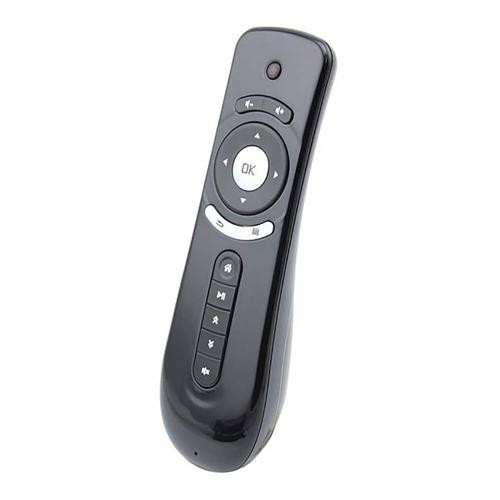
  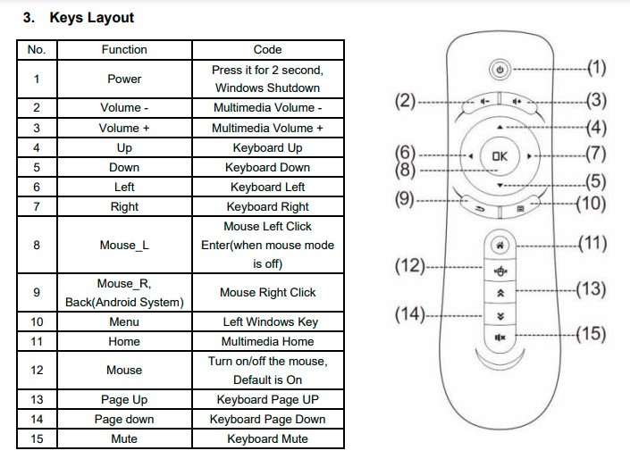
- **G10s**  
  Цена $3. Берите обычную версию без БТ и без подсветки  
  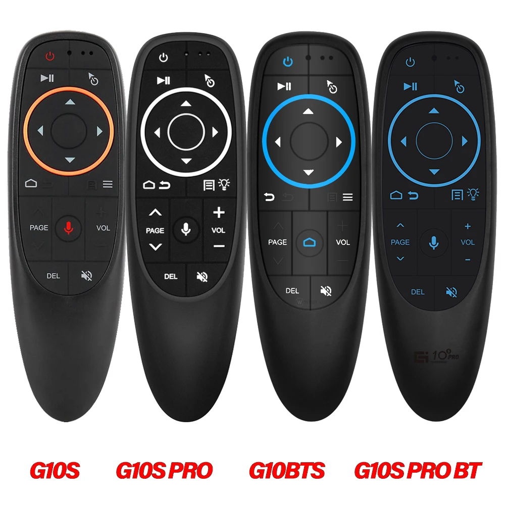
- **Air Mouse G20s / G20s Pro**   
  Цена $5. Удобный пульт. Версия Pro с цифровой клавиатурой, но она $8. Есть версия с блютузом  
  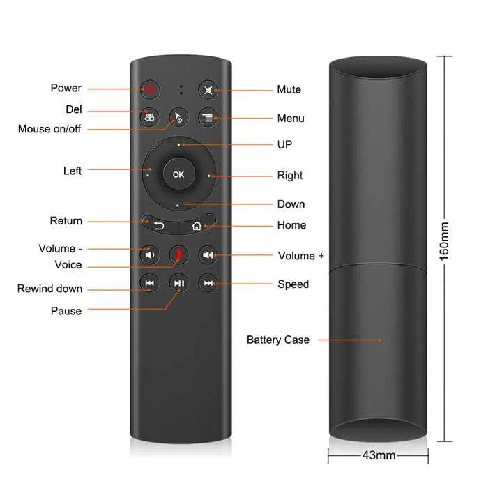
  
  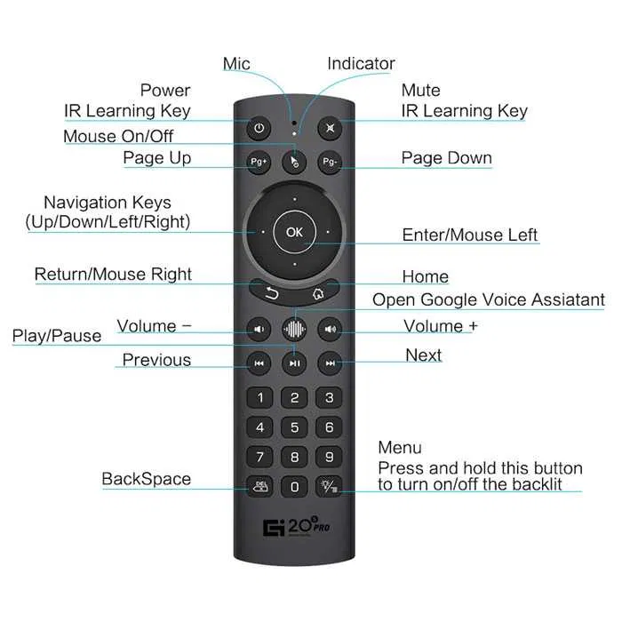
- **Air Mouse G50s**  
  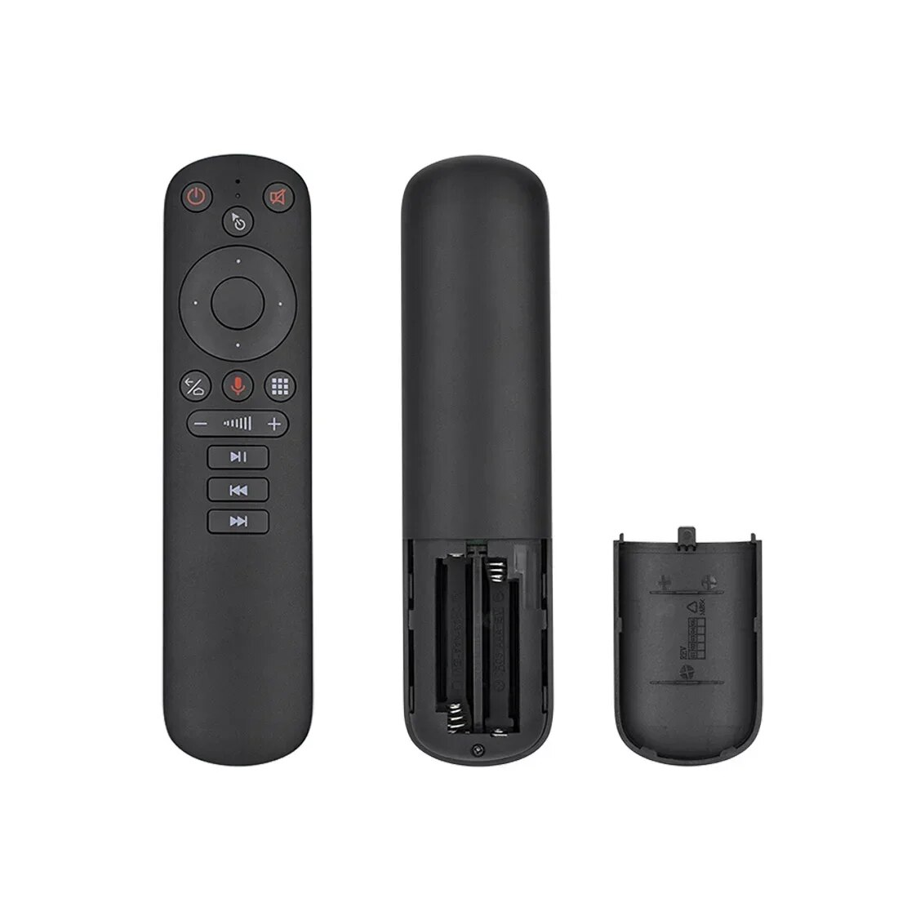
- **Remote M5**
  Цена $1.99 Простой пульт без гироскопа, без голоса. Простой, да удобный
  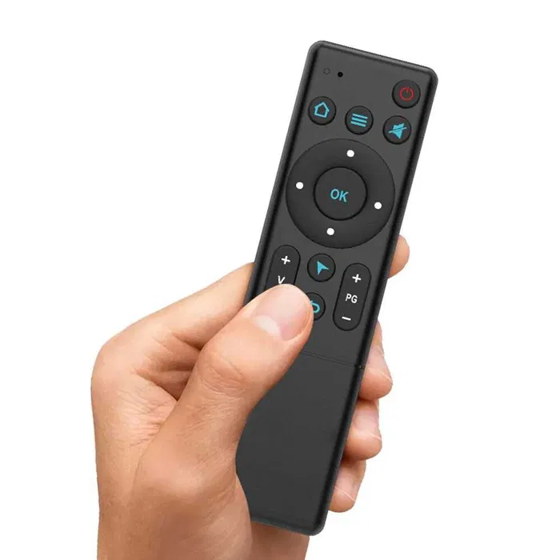
  
  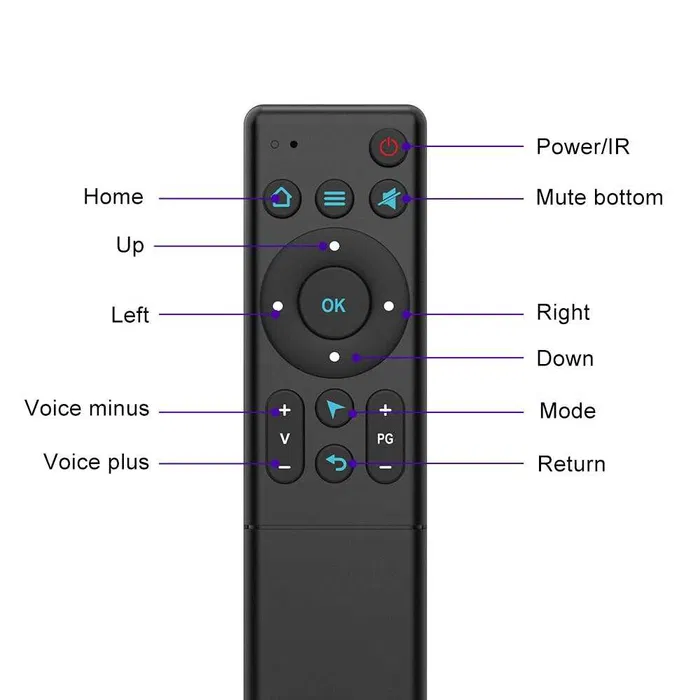
- Air Mouse Ugoos UR-01
- BPR2S

## Клавиатуры
- C120  
  пульт с клавой. для управления виндой не хватает важных системных клавиш  
  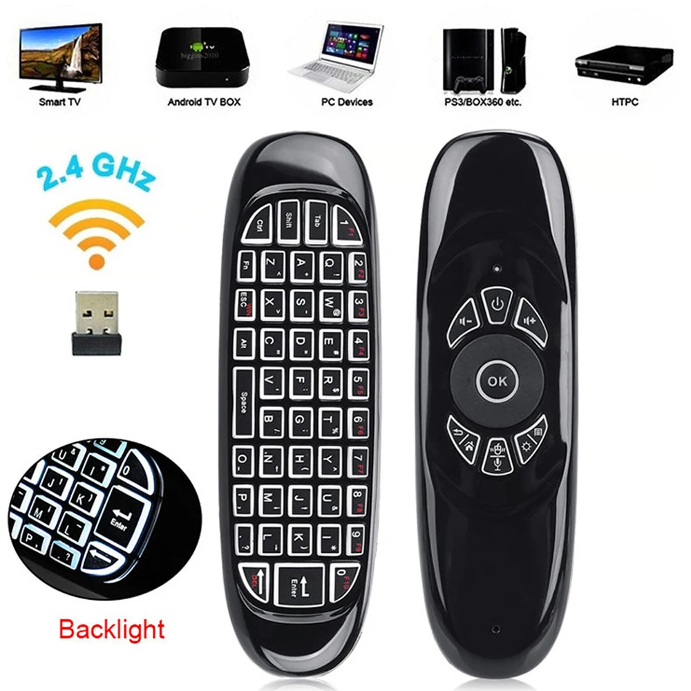
- Air Mouse G60s  
  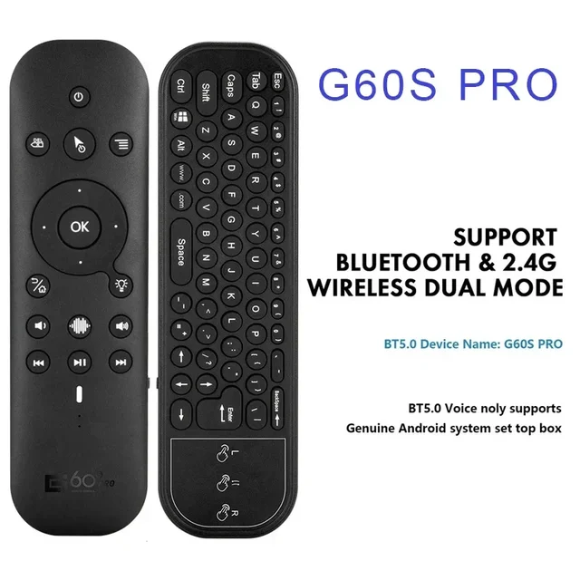
- большая, но дешевая клава  
  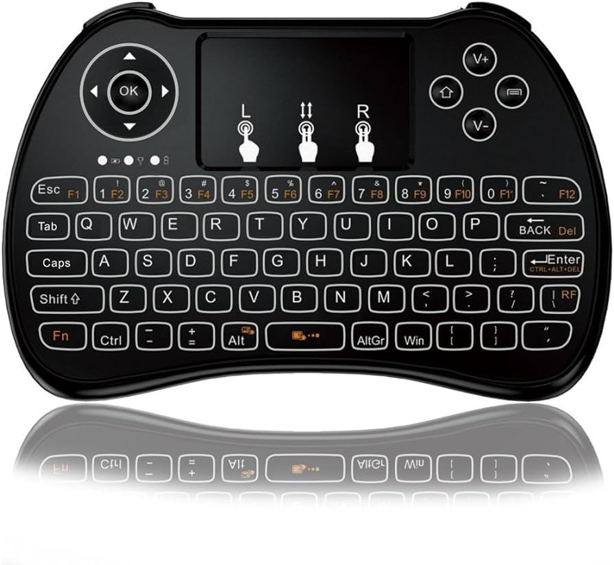
- клавиатура с тачпадом $10 

## ИК-пульты
- Samsung BN59  
 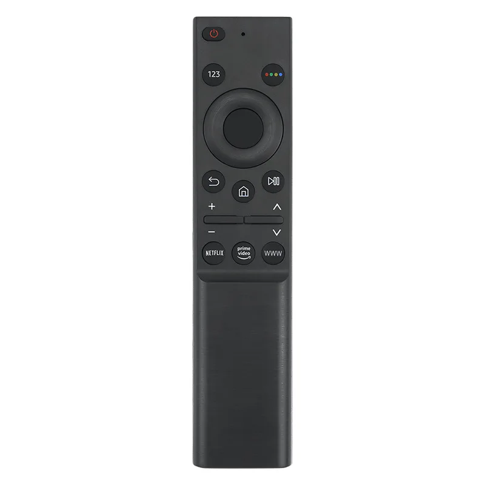
 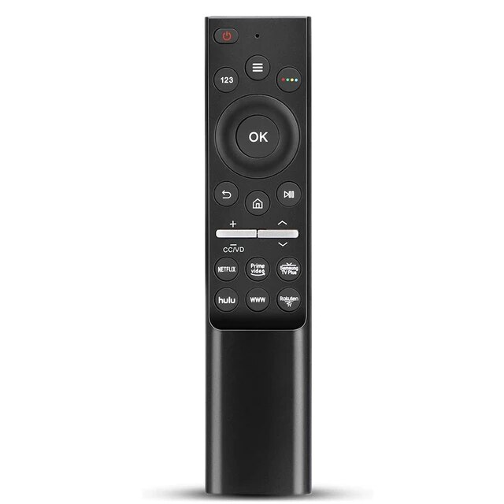
  
