

- toc
{: toc }

Все что находил на алике добавил в [список избранного](https://www.aliexpress.com/p/wishlist/shareReflux.html?groupId=xet8nB20ye162%2Bx176OYvyKcbz8H075XEjM%2FVz60i08%3D). Если решишь покупать там - используй [скидки для покупки](../r/ali.md)

## Аэромышки
- **T2 Air Mouse**  
  Цена $6. Пульт выпускался в 2013 году. Удобный хват, удобная раскладка. Кнопку дом можно переназначит в виндовсе на запуск какого то приложения, я назначил диспетчер задач  
  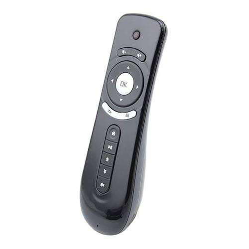 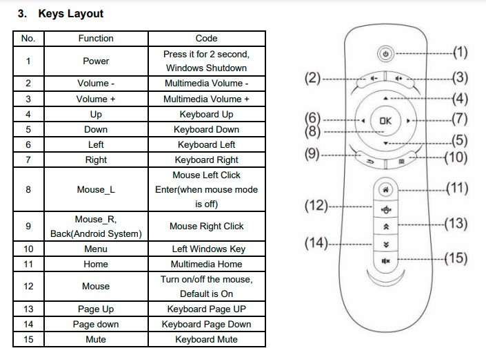
- **G10s Air Mouse**  
  Цена $3. Берите обычную версию без БТ и без подсветки  
  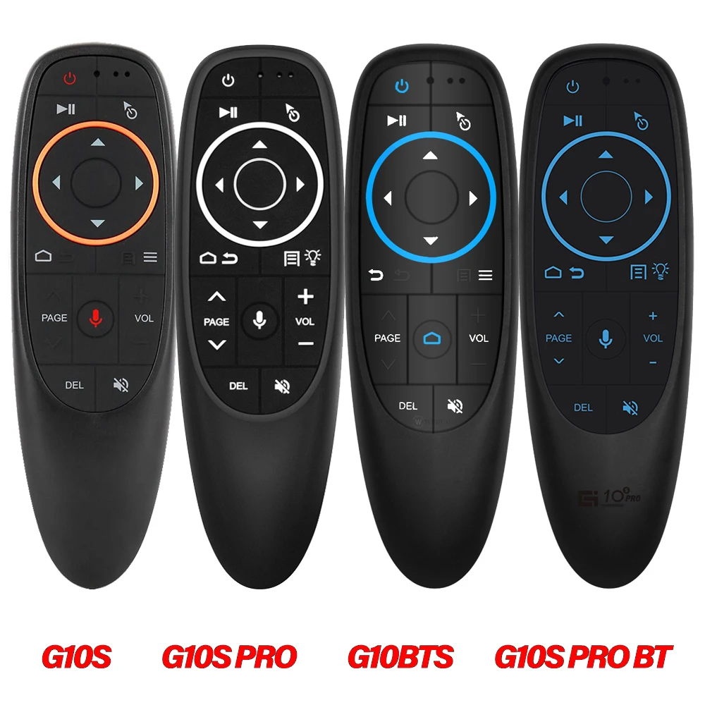
- **G20s / G20s Pro Air Mouse**   
  Цена $5. Версия Pro с цифровой клавиатурой, но она $8. Есть версия с блютузом. Удобный пульт  
  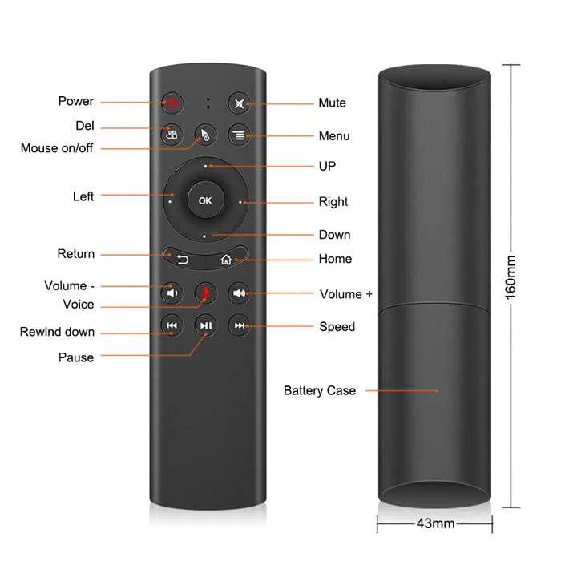  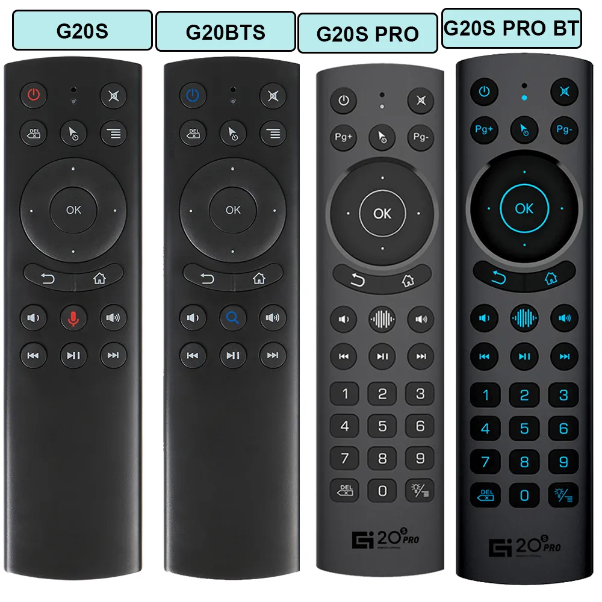
  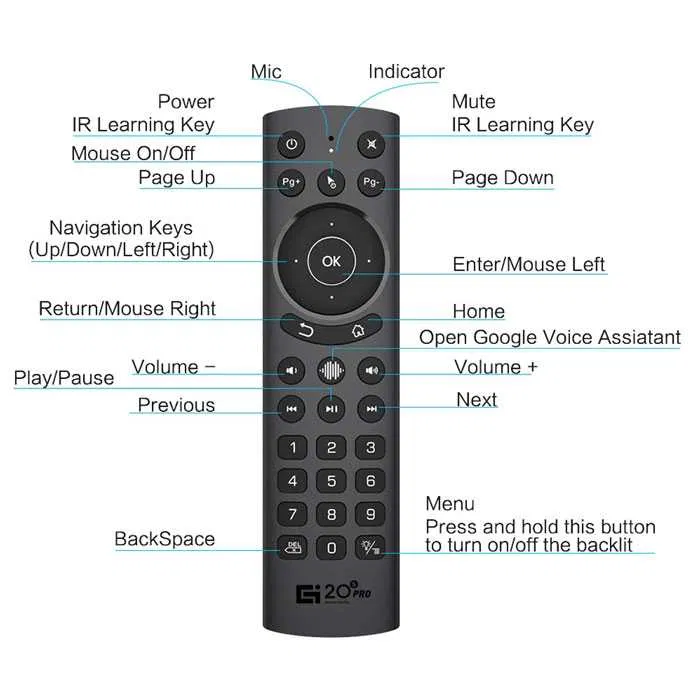
- **Air Mouse G50s**  
  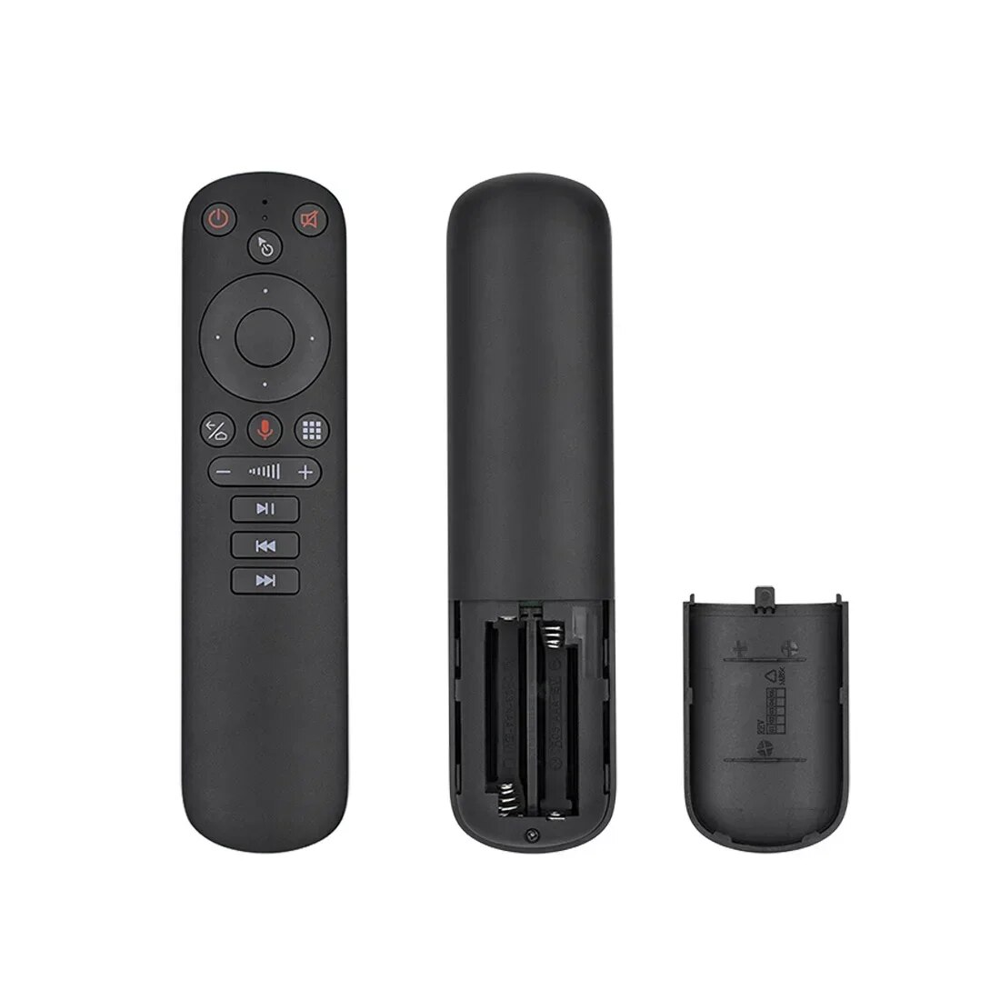
- **M5 Bluetooth 5.2 Remote control**  
  Цена $1.99 по акции. Простой пульт без гироскопа, без голоса. Простой, да удобный. Очень приятно лежит в руке. Кнопки резиновые - собирают пыль. Раскладка норм, но не идеал, я бы расположил по другому. Подключается по блютуз. Питается от двух батареек ААА. Потребляет 0.5мА. Сразу обнаружил недостаток: когда зажимаешь какую-то кнопку, то нажатие передается только раз. Соответственно все сценарии, где используется длительное нажатие сразу же отпадают. Нет кнопки плей пауза. Кнопки подписанные как PG, на самом деле это медиакнопки переключения NEXT и PREV. Я переназначил PREV через AutoHotKey на старт/пауза: `vkB1::send, {Media_Play_Pause}`. в режиме без курсора кнопка ОК присылает код ENTER, а кнопка НАЗАД присылает код BACKSPACE. Поэтому можно без настройки пользоваться на винде. На кнопку ДОМ через твикер назначил диспетчер задач. Кнопку ВКЛ можно программировать на ИК-сигнал. Для этого нужно зажать кнопку ОК и ВКЛ одновременно, затем направить оригинальный пульт на светодиод и клацнуть нужную кнопку. Пульт при этом никаких признаков что он был запрограммирован не показывает. При нажатии кнопки ВКЛ одновременно передаются два сигнала: ИК и блютуз. То есть одним махом отключаются и телек и приставка. Насколько это удобно - спорный вопрос, мне не нравится. Еще прикол заметил, что я запрограммировал одну ИК-кнопку, но пульт подхватил и все остальные клавиши. Теперь он как бы вополняет функцию оригинального ИК-пульта. Походу прошивка пульта умеет понимать какой пульт я хотел клонировать и польностью им прикидывается. Я сначала очень удивился, когда это обнаружил, ибо у моей приставки нет блютуза, но я умудрился управлюять ею блютузным пультом, лол. Кстати, больно смотреть как этот пульт в ИК-режиме эмуляции мышки двигает курсор всего на один пиксель при длительном нажатии кнопок джойстика, это явный просчет разработчиков. Длинное удержание кнопки ВКЛ в ИК режиме блокирует экран, меню перезагрузки не вызывается. Также в инструкции сказано как сбросить настройки на заводские: ОК + VOL+, удерживать пять секунд
  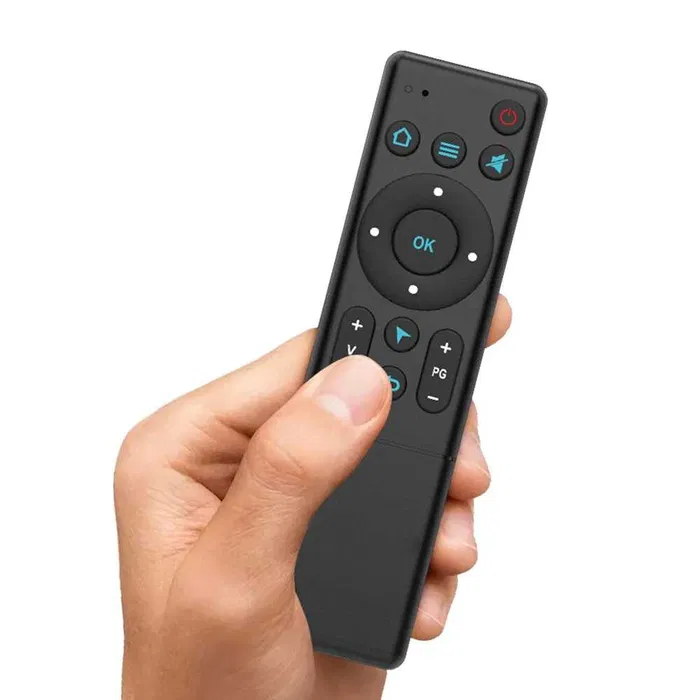  
  
- **Q5 Air Mouse**  
  Цена $3 на распродаже. Не очень удачное расположение кнопок. На компе под виндовсом не удобно пользоваться.  Микрофон - ужасный, кое-как слышно и очень много цифровых шумов. В винде определяется. Звук начинает передавать после нажатия кнопки и пока не уснет. Возможно для голосового поиска будет и достаточно, я не пользуюсь. В режиме отключенной аэромышки кнопка OK посылает код Enter. Нет кнопки плей/пауза, мне не хватает ее. Но зато несомненный плюс - раздельные клавиши домой и назад. Есть одна обучаемая ИК-клавиша (вкл). Что бы запрограммировать надо зажать ее на 10 секунд. Она работает, но посылает единичный импульс. Например, перезагрузить телевизор/приставку длинным удержанием кнопки не получится. Ненадежный корпус, очень плохие защелки, ломаются с пол-тычка. Я умудрился сломать три защелки за одну разборку. Когда пульт уснул по таймауту, то при первом нажатии кнопки он ее игнорирует и сначала появляется курсор, а потом уже можно им пользоваться.
- **C120 Air Mouse RGB Keyboard**  
  Пульт с клавой. Правильное эргономичное расположение клавиш на пульте. Бесит только что кнопки назад и домой совмещены. Для управления виндой не хватает важных системных клавиш. Нет Esc, Win, Del... Стрелочки нажимаются через FN, короче бред. Раскладка ваще неудобная, без подсветки не разберешься. А если пользоваться подсветкой, но надо что бы на клаве были русские буквы. У меня экземпляр только с латиницей. Для андроида прям отлично, но опыт показывает что сама клавиатура тут лишняя ;-)  Возможно клавиши qwerty получится забиндить как горячие клавиши через в какой-то программе, тогда это будет отличный пульт управления. А пока это просто обычная аэромышка, по типу старой T2. Курсор мышки не дребезжит, прям очень хорошо. Работает от аккумулятора с защитой. Судя по размерам - объем около 300 мАч. Зарядка TP4054. Кнопка включения обучаемая. Программируется через длинное нажатие. В моем экземляре с алика не был припаян светодиод. Когда я его припаял - он начал светиться КРАСНЫМ. Пришлось пересадить диод из донора, теперь работает. Длинное нажатие обрабатывается корректно - можно перезагрузить телек/приставку. Максимум два одновременных нажатия на кнопки. Некотрые комбинации из трех клавиш не работают, например Ctrl+Shift+V
  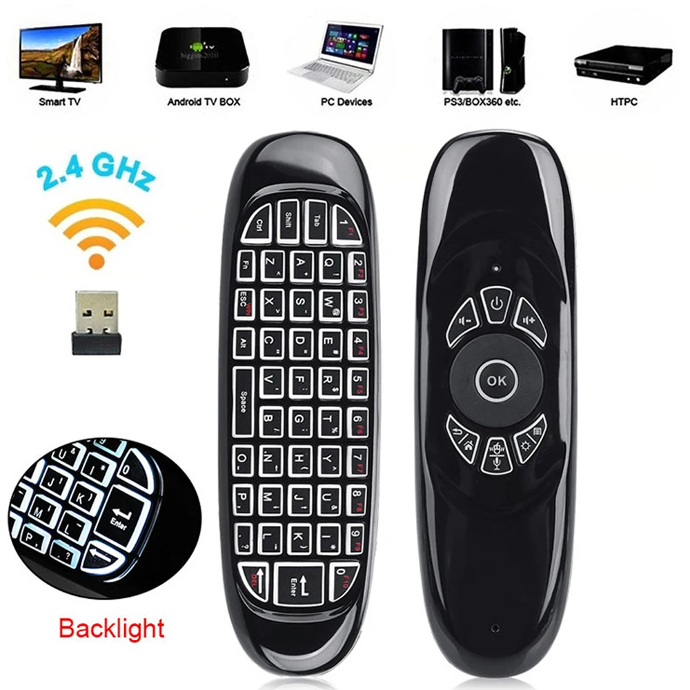
- **Ugoos UR-01 Air Mouse**
- **BPR2S**

## Мини-клавиатуры
- **G60s Air Mouse**  
  Крутая, но дорогая
  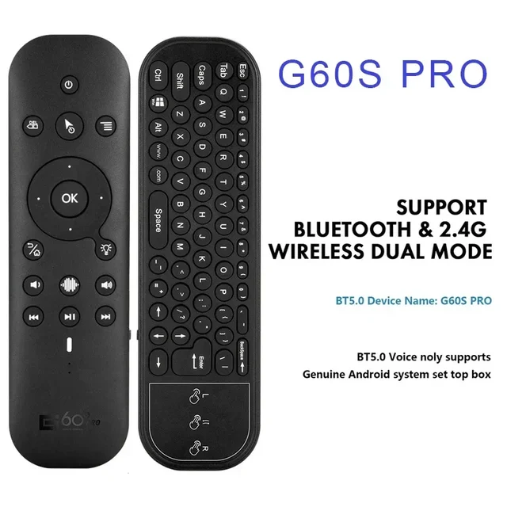
- **i8 mini keyboard**  
  Цена $5. Большая, но дешевая клава  
  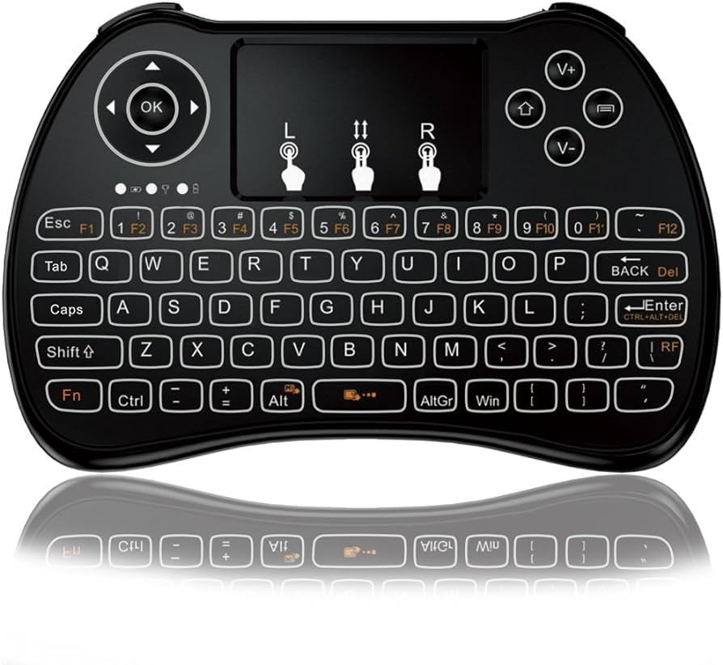
- **RT-MWK02 mini keyboard**  
   Цена $10. Клавиатура с тачпадом. Раскладка норм. И тачпад норм. Мне попался брак- часть областей тачпада не реагирует, но даже так можно пользоваться, я не сразу заметил. Питается от аккумулятора, заряжается кабелем мини юсб. Прям в корпусе клавиатуры встроена ниша для хранения USB-адаптера. Есть подстветка, достаточно равномерная, свет в глаза не режет. Есть русские буквы на клавишах. Через сочетание Fn+Alt можно повернуть на 90 градусов действие стрелочек с тачпадом и тогда клавиатура становится пультом, компактные размеры позволяют. Есть встроенная лазерная указка. Возможно именно это повлияло на решение купить ее на пробу ;-)

## ИК-пульты
- **Samsung BN59**  
 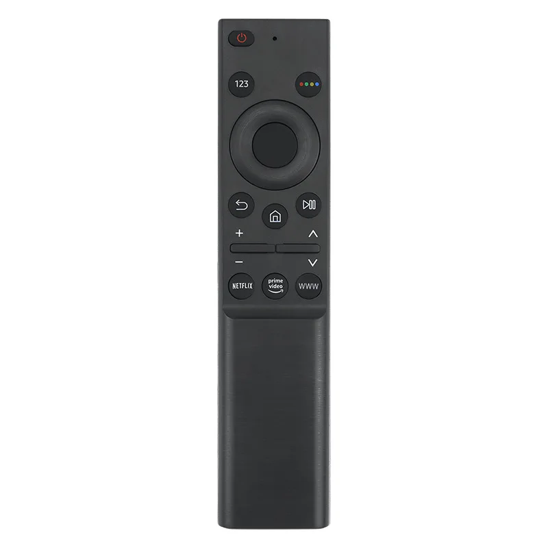 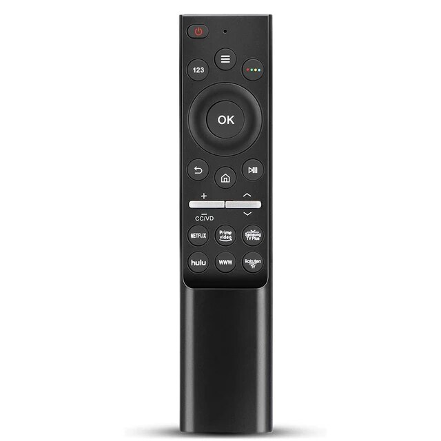

## пульты
- Беспроводная клавиатура с тачпадом $10 
- джойстики
- Air Mouse 2016
- Air Mouse G20s Pro
- Air Mouse G50s
- Air Mouse Ugoos UR-01

## Полезные ссылки
- [4PDA. Пульты для Android miniPC, ТВ, медиацентров и прочего](https://4pda.to/forum/index.php?showtopic=400717&st=31100)
