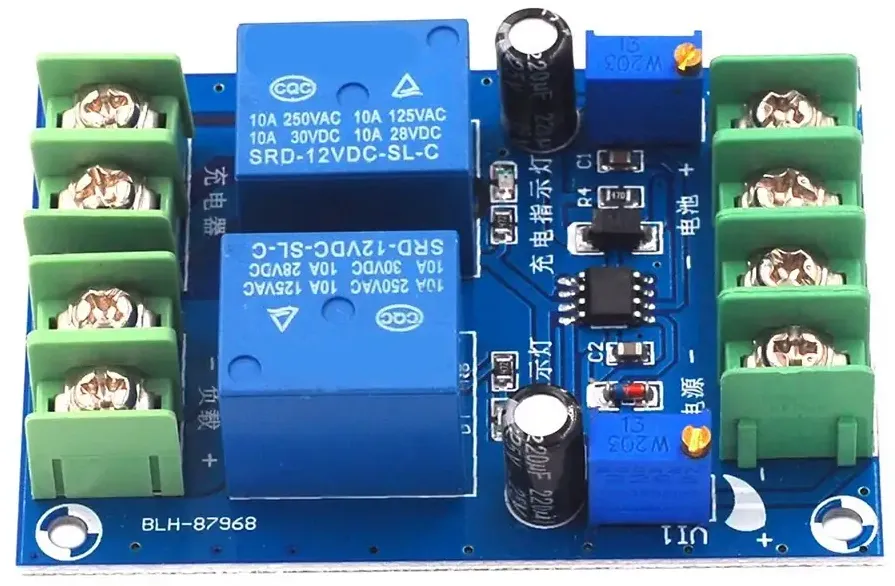
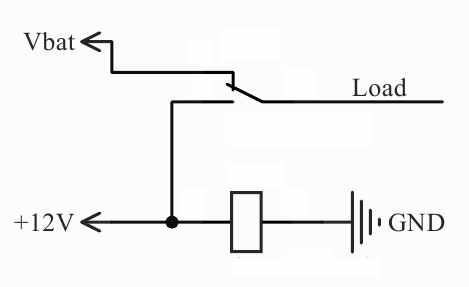

- toc
{:toc}

Купил я этот модуль с надеждой сделать из него бесперебойник для домашней электроники. В этот модуль встроена микросхема NE555, на основе которой реализована функция контроля напряжения. На картинках продавец предлагает использовать данную фичу что бы управлять зарядным устройством непосредственно по линии 220 вольт или переключая низковольтную часть (БП должен быть CV/CC). 

Управление линией 220V:

Управление низковольтной линией (БП должен уметь отдавать стабильный ток):

### Функция защиты от перезаряда
Уровни срабатывания можно регулировать двумя крутилками. Принцип действия контроллера следующий. При достижении на аккумуляторе уровня Vbatmin микросхема включает реле. Через реле подключено зарядное устройство. После включения реле оно начинает зарядку батареи. Когда напряжение на батарее достигнет напряжения Vbatmax, то реле отключится и зарядка прекратится. Подзарядка по новой включится только когда напряжение опять упадет до уровня Vbatmin. То есть обеспечивается гистерезис, что бы не аккумулятор не стоял постоянно на зарядке. Это и весь функционал модуля. Все. Финита

Для теста я использовал свинцово-кислотный аккумулятор от скутера. Задал такие уровни напряжений: Vbatmin = 12 в, Vbatmax = 13.8 в

Тоесть когда аккум разрядится на половину - включится подзарядка. В описании данного реле заявлена защита от переразряда. Это фейковая защита. Сами подумайте, если аккум переразрядился, то с него надо бы снять всю нагрузку, а этот модуль подает дополнительную в виде релюшки. Видимо предполагается что начнется подзарядка аккумулятора

Легенда. Зеленым показан заряд. Красным - саморазряд, когда аккум отключен и просто ждет. Синим - работа в аварийногм режиме от аккума (он разряжается быстрее). И вот на уровне где напряжение пересекает уровень 50% - должна включиться подзарядка. В данном случае этого не происходит, так как нет сети. А когда она появляется - аккумулятор начинает заряжаться. И так по кругу

Как по мне, такой режим работы актуален только если аккумулятор действительно исполшьзуется как аварийный источник питания. В этом случае оправдано хранить его в "полуразряженном" состоянии. Ну или, по крайней мере, не мучить его постоянной дозарядкой до напряжения "Cyclic charge voltage". Так аккумулятор точно прослужит гораздо дольше. Даже дольше, чем если держать его под напряжением "Floating voltage"

### Режим бесперебойника
В этой плате есть еще одно реле, которое реализует функцию переключения между блоком питания и батареей. Что бы нагрузка всегда была запитана. Получается что то типа ИБП. Но не без недостатков. При переключении реле проходит около секунды. Все из-за схемы включения. Роутер к такому UPS не подключишь - будет перезагружаться. А вот для освещения - нормас. 

Пояснение к схеме. Внешний блок питания подключается к нормально разомкнутому контакту реле, а батарея к нормально замкнутому. Катушка запитывается напрямую от внешнего БП. Соответственно, притягивает якорь реле на нормальноразомкнутый контакт (+12V). Когда сетевое напряжение пропадает и БП перестает подавать 12 в на катушку, то общий контакт релюшки переключается на батарею. Так реализована функция автоматического переключения. Типовое включение электромагнитного реле

### Может высадить аккум в ноль

Так вот. Я считаю, эту плату нельзя использовать в режиме бесперебойника. В ней нет защиты от переразряда. (Более того, сама служит нагрузкой для аккумулятора). Если нет напряжения и нагрузка питается от батареи. То батарея, логично предположить разряжается. При достижении порога Vbatmin включится реле для зарядки. И... ничего не произойдет! Сети 220 то нету... Нагрузка продолжит разряжать батарею пока та не разрядится в ноль...

Окай. А что если переделать данную плату? Ведь здесь уже есть схема сработки по нужным напряжениям. Нужно только правильно скоммутировать провода, что бы поменять логику работы. Что бы разобраться как это сделать я разобрал плату и срисовал схему

Голая плата без релюшек и разъемов (18+)

Схема. Внимание! Не проверял. Может содержать ошибки. Что бы лучше рассмотреть - откройте картинку в новой вкладке 

Схема перерисованная из платы yx851

### Переделка в режим "защита от переразряда"

Что я бы поменял в модуле? Ну изначально стоит сказать что это очень плохой модуль, плохо настраивается, неправильно работает (даже если следовать предусмотренному сценарию). Поэтому я бы порекомендовал его не покупать. Но если он уже есть в наличии, то прям руки чешутся его переделать. Чего пылиться добру?
- сделать защиту аккумулятора от переразряда (вместо "автоматической подзарядки"). Прячем обязательно через нормально разомкнутый контакт. Чтобы при сработке защиты с аккумулятора снять любую нагрузку
- на вход реле, которое переключает источники подать напряжение не напрямую от аккумулятора, а через защиту (см. предыдущий пункт)

Фронт работ понятен. Работы много, будем резать дороги, паять новые. И главное обдумывать сценарий, как это должно работать. 
В первую очередь я настроил сработку реле "Charger" по сценарию как было задумано китайцами. Это оказалось очень непросто сделать. Подстроечники многооборотные и их нужно крутнуть примерно 50 раз что бы добраться от одного края к другому. Найти нужное положение очень сложно. Крутилки зависят одна от другой. Инженеры которые делали этот модуль просто сэкономили пару SMD-резисторов, не устранив возможность выставлять напряжения сработки в полном диапазоне от 0 до Uвх. 

В общем настроил что бы реле которое помечено как Charger включалось при нужном мне напряжении. Далее попытался приспособить это реле для защиты аккумулятора. Прикол в том, что NE555 подает высокий уровень при сработке нижнего уровня напряжения. Тоесть реле включается. Для защиты это не подходит, о чем я уже писал выше. Нужно этот сигнал инвертировать. Сначала хотел допаять на плату один транзистор, но потом понял что будет достаточно второй вывод катушки подключить к плюсу питания вместо земли. Проводок припаять легче, чем транзистор. Китайцы кажется специально сделали линию земли максимально тонкой, видимо что бы мне было легче резать

Разрезать нужно в двух местах (сверху и снизу). Там катушку подключается к земле. На верхней стороне платы в месте где надо сделать надрез установлено реле. Но снимать его не обязательно, достаточно слегка надрезать его корпус и таким образом добраться до платы

Сверху

Снизу надрез сделать легче. На этом же фото обозначено как проще всего подключить вывод катушки к плюсу. Перед тем как подпаивать провод на плюс - прозвоните тестером, иначе соединение плюса с минусом чревато фейерверками

Снизу

**Вот что получилось**
Теперь работа модуля инвертирована до наоборот. Когда напряжение батареи достаточно высокое, то нагрузка может быть запитана от батареи. Реле при этом потребляет энергию 100мА. Но это не страшно, внешнее зарядное устройство компенсирует этот ток. Но вообще, данный недостаток кому то покажется критичным и он откажется от переделки. Мне было лень разбираться с данной проблемой, оставил как есть

В случае когда напряжение АКБ упало ниже критического, то реле отпускается. Теперь ничто не сможет вытянуть соки из аккумулятора. Ну разве что сам таймер 555. Потребление схемы с выключенными релюхами составляет около 15мА. Это типа режим защиты. Второй фактор отказаться от данной платы вообще; Как вам такой ток холостого хода? ;-)

### Переделка реле UPS

На вход реле, переключающего источники, сейчас подключен аккумулятор напрямую. А надо бы с выхода защиты. Режем одну дорожку и припаиваем два провода

Фото с перемычками

Пояснение. Аккумулятор подключен на нормальноразомкнутый контакт реле защиты. Общий контакт данного реле подключен на нормальнозамкнутый контакт реле переключения. Получается что ток от аккума проходит через оба реле. И только если на оба-два реле подан разрешающий сигнал, то ток пойдет на нагрузку
1. Первый разрешающий сигнал - напряжение внешнего блока питания (оно должно отсутствовать, что бы модуль переключился на питание от аккумулятора)
2. Второй разрешающий сигнал от контроля разряда (который мы переделывали выше). Нужен что бы не переразрядить аккум

Блок схема модуля после переделки. Толстыми синими линиями изображены силовые линии. Тонкими оранжевыми - линии управления

**Важно!**
Регулировка крутилками теперь тоже поменяла свое значение. Крутилка V11 теперь отвечает за напряжение батареи при котором отключится выходное реле. А крутилка V12 регулирует напряжение, при котором защита снимется. Это нужно для обеспечения гистерезиса, что бы не было постоянных миганий из-за восстановления напряжения батареи при отключении нагрузки

фото с новыми обозначениями "Откл" и "Восст" на модуле

### Какие альтернативы
Стоит заметить, что в китайских интернет магазинах также продается более элегантный модуль, собранный на LM358. Он дешевле, не требует переделки. Возможно о нем тоже выйдет заметка, так как в нем применена отличная технология обеспечения гистерезиса - положительная обратная связь. И мне не терпится разобрать еще и его

Фото модуля защиты свинцово-кислотной батареи на LM358

Есть статья про похожий модуль XH-M601 <https://mysku.club/blog/aliexpress/89488.html>
