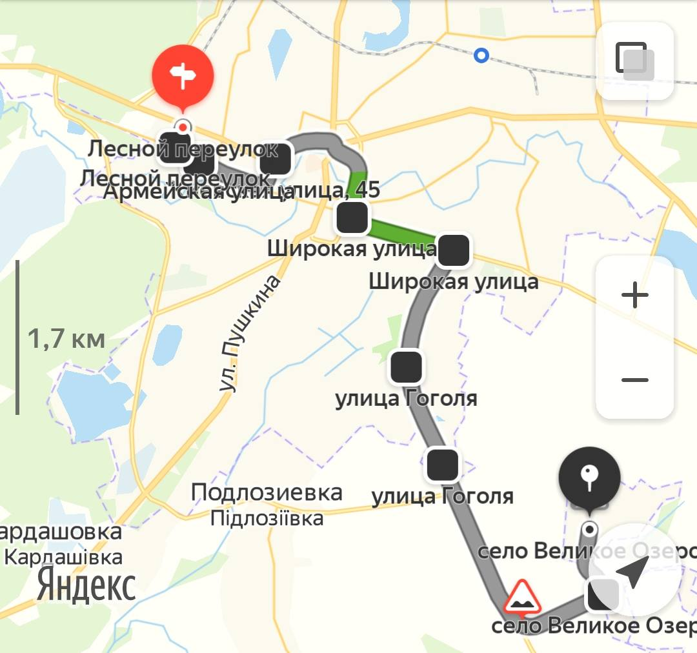

# 11

## Остановки

### дачный – в.озеро
1. Дачный
1. Ромашка
1. Гоголя
1. Зоря
1. В. Озеро [07:00, 13:00, 18:00]

### в.озеро – дачный
1. В.озеро [07:00, 13:00, 18:00]
1. Зоря
1. Гоголя
1. Ромашка
1. Дачный

### Картинка
[ Посмотреть на карте](https://yandex.ru/maps?rtext=50.310525%2C34.871155~50.308556%2C34.869968~50.30733%2C34.873589~50.307441%2C34.885215~50.301746%2C34.896903~50.298543%2C34.912355~50.287158%2C34.905136~50.277617%2C34.910662~50.264975%2C34.935128~50.27133%2C34.933024&rtt=auto)
